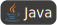
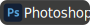
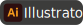

<h1>Hi 👋, I'm Kyler</h1>
<h3>Full-Stack Developer & Web Scraping Enthusiast</h3>

  
  &nbsp;&nbsp;
  
  &nbsp;&nbsp;

## 😃‍💻 Introduction
- 🎓 BSc in Software Engineering
- 💼 Committed to becoming a full-stack developer
- 🕷️ Web crawler enthusiast
- 🖥️ Current project: [Live Demo](http://165.232.166.136/#/) — `user: admin` / `password: 123123`

---

## ⌚ My Status

### 👨‍💻 Working
- Actively seeking a **Web Developer** position

### 📚 Learning
- SpringBoot
- React

---

## 😋️ Habit
- ✈️ Travel
- 🐠 Animal
- 🕸️ Web Crawling
- 🎥 Video Editing
- 🎸 Guitar
- 💰 Investment

---

## 💻 Technical Skills

### 🐍 Programming Languages

---

### ✨ Frontend Development

---

### ⚙️ Backend & Frameworks

---

### 🗄️ Databases

---

### 🛠️ Tools & DevOps

---

### 🎨 Design & Prototyping

---

### 💻 IDE & Editors

---

### 🧾 Others

---